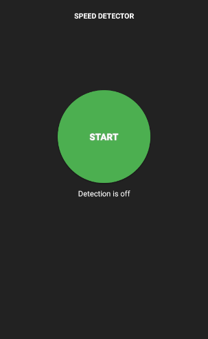
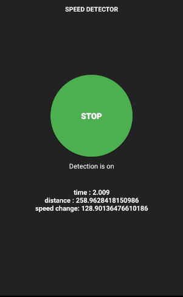
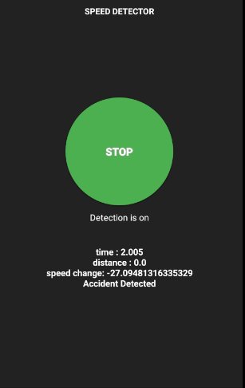

# Realtime-Vehicle-Speed-Detector

Speedometer detect your vehicle speed after every 2 sec with your previous and current latitude and longitude.

## Android UI

## Usage

The following snippet shows how you can use Speedometer in your project.

### In Java
'''

        public void startService(boolean isReceiving) {
        
        Intent serviceIntent;
        Intent speedDetectorService;
        
        if (isReceiving) {
        
            serviceIntent = new Intent(this, LiveLocationReceivingService.class);
            speedDetectorService = new Intent(this, SpeedDetectorService.class);
            tvStatus.setText("Detection is on");
            
        } else {
        
            serviceIntent = new Intent(this, LiveLocationSendingService.class);
            speedDetectorService = new Intent(this, SpeedDetectorService.class);
            tvStatus.setText("Detection is on");

        }

        ContextCompat.startForegroundService(this, serviceIntent);
        ContextCompat.startForegroundService(this, speedDetectorService);
        Intent intent = new Intent(this, SpeedDetectorService.class);
        Intent speedDetectionIntent = new Intent(this, SpeedDetectorService.class);
        ContextCompat.startForegroundService(this, intent);
        ContextCompat.startForegroundService(this, speedDetectionIntent);
        tvStatus.setText("Detection is on");

    }

    public void stopService() {
        Intent serviceIntent = new Intent(this, LiveLocationSendingService.class);
        Intent speedDetectionServiceIntent = new Intent(this, SpeedDetectorService.class);
        stopService(serviceIntent);
        stopService(speedDetectionServiceIntent);
        tvStatus.setText("Detection is off");
    }
'''

